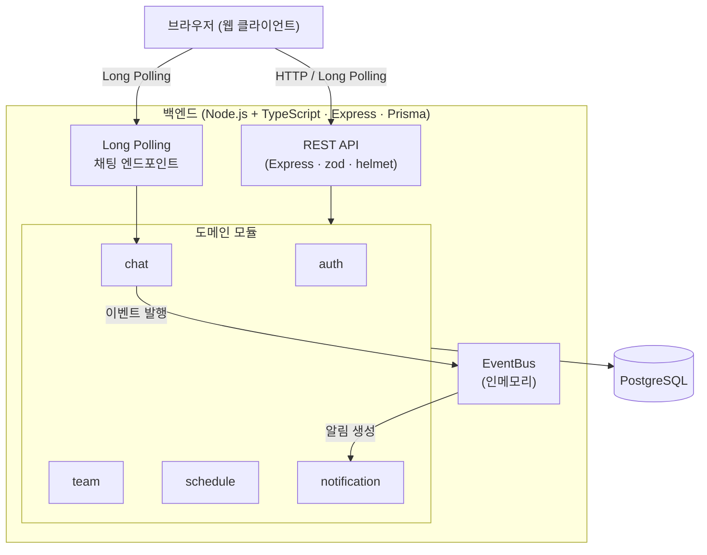
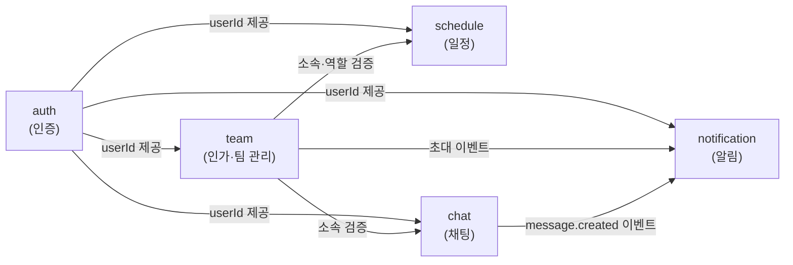
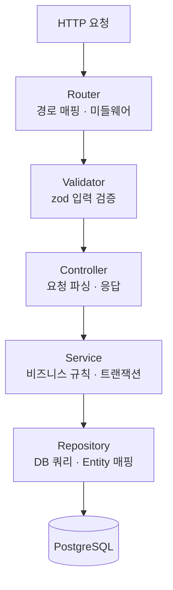
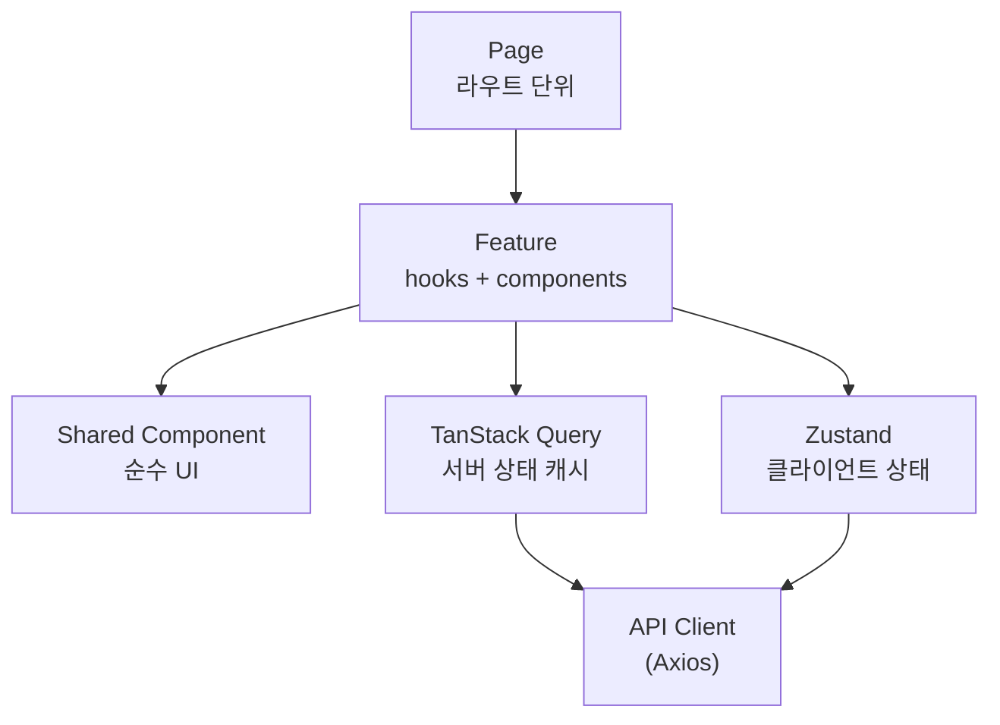
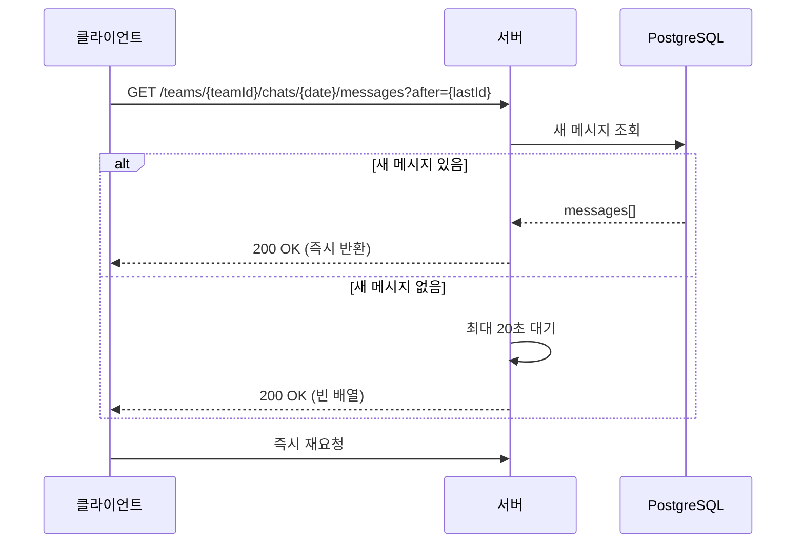
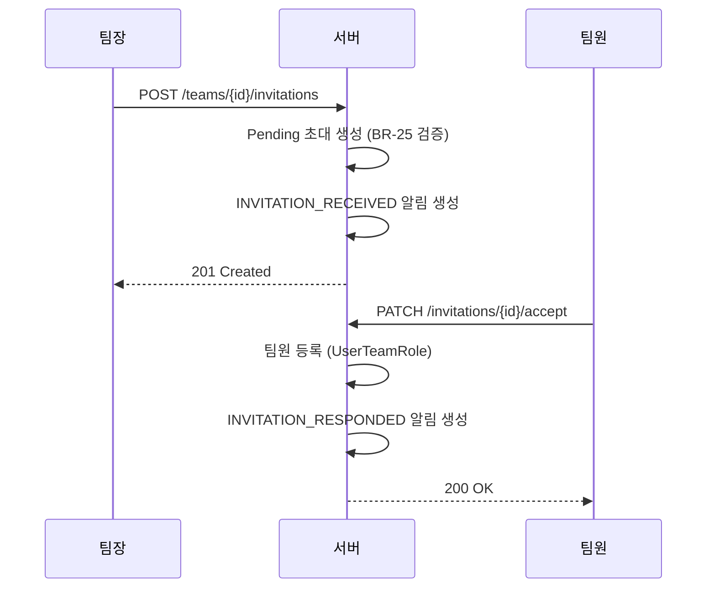
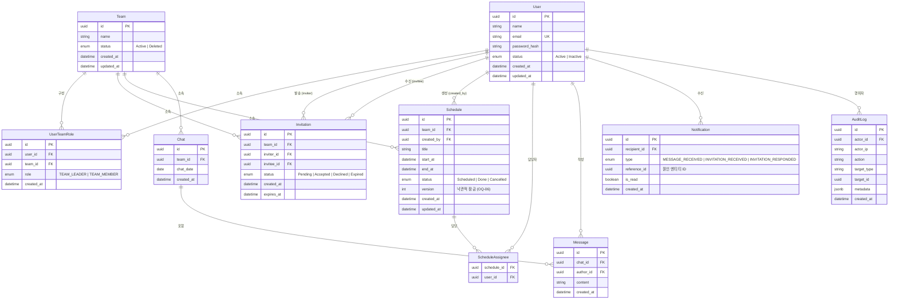

# Team CalTalk 기술 아키텍처 다이어그램

> **버전**: v1.2 | **작성일**: 2026-05-05 | **수정일**: 2026-05-05 | **기준**: v1.0 Modular Monolith

---

## 0. 기술 스택 명세

| 영역 | 기술 | 비고 |
|------|------|------|
| **런타임** | Node.js LTS + TypeScript (strict) | 백엔드 |
| **백엔드 프레임워크** | Express.js | REST API, Long Polling |
| **ORM / 마이그레이션** | Prisma | schema.prisma 기반, Prisma Migrate |
| **데이터베이스** | PostgreSQL | 단일 인스턴스 (v1) |
| **인증** | JWT(HS256) — jsonwebtoken | Access 15분, Refresh 7일 |
| **비밀번호** | bcrypt (salt rounds ≥ 12) | |
| **입력 검증** | zod | API 레이어 런타임 검증 |
| **로깅** | pino | JSON 구조화 로깅 |
| **보안 헤더** | helmet | |
| **속도 제한** | express-rate-limit | |
| **이벤트 버스** | Node.js EventEmitter (인메모리) | v2에서 Redis Pub/Sub으로 교체 가능 |
| **프론트엔드 빌드** | Vite | |
| **프론트엔드 프레임워크** | React 18 + TypeScript | |
| **라우팅** | React Router v6 | |
| **서버 상태** | TanStack Query (React Query v5) | 캘린더, 채팅, 알림 |
| **클라이언트 상태** | Zustand | 인증 정보, 선택된 팀 |
| **HTTP 클라이언트** | Axios | 토큰 갱신 인터셉터 포함 |
| **백엔드 테스트** | Jest + Supertest + Testcontainers | 통합 테스트: PostgreSQL 컨테이너 |
| **프론트엔드 테스트** | Vitest + React Testing Library | |
| **E2E 테스트** | Playwright | |

---

## 1. 전체 시스템 구조

---

## 2. 도메인 의존 관계

---

## 3. 백엔드 레이어 구조

---

## 4. 프론트엔드 레이어 구조

---

## 5. 채팅 Long Polling 흐름

---

## 6. 팀원 초대 흐름

---

## 7. ERD (Entity Relationship Diagram)

**주요 설계 결정:**

| 결정 | 내용 |
|------|------|
| Chat은 (team_id, chat_date) 복합 유니크 | 팀당 날짜별 채팅방 1개 보장 |
| Message는 chat_id 참조 | Chat 엔티티를 통해 팀·날짜 context 획득 |
| ScheduleAssignee 별도 테이블 | 담당자 0명 이상 허용 (BR-75) |
| Schedule.version 컬럼 | 낙관적 잠금 (OQ-06, 동시 편집 충돌 방지) |
| AuditLog.actor_id nullable 허용 | 시스템 이벤트(배치 등) 기록 가능 |
| UserTeamRole 팀별 독립 | 동일 사용자가 팀마다 다른 역할 보유 가능 |
| Notification.reference_id | Message 또는 Invitation ID를 다형성으로 참조 |
